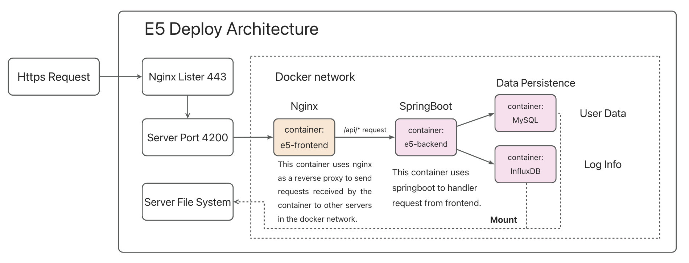
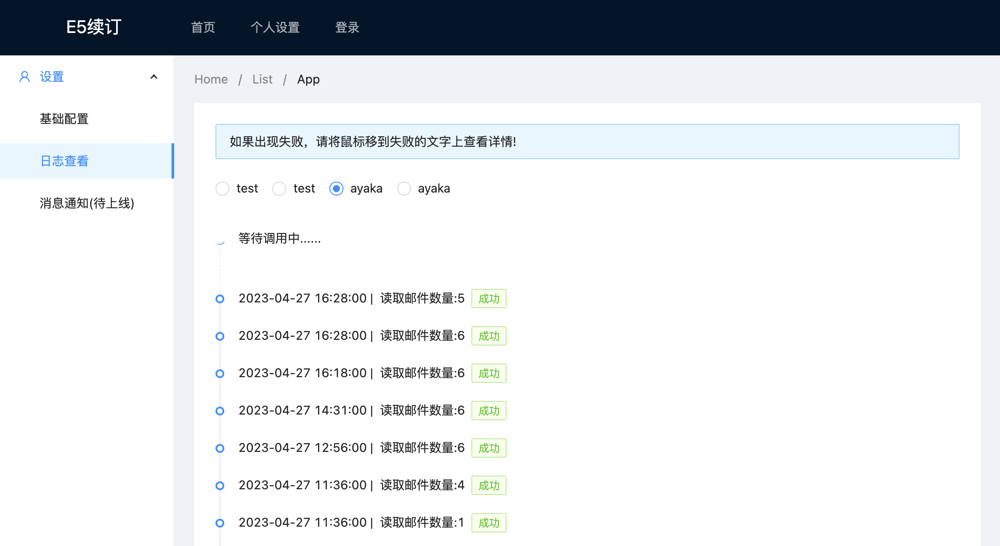
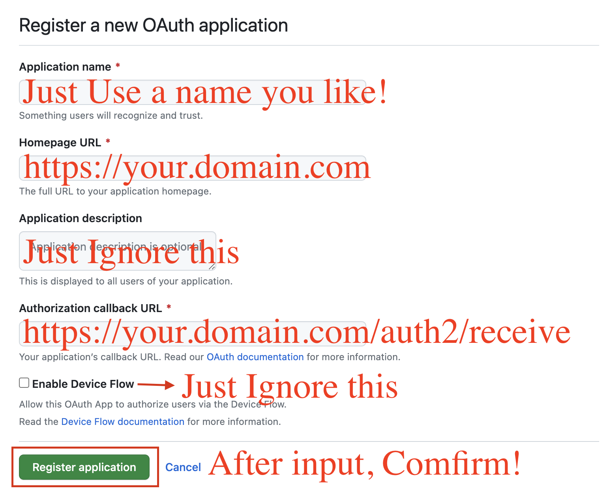

## E5-Toolkit

Welcome to participate in e5@next. To find out more, visit [e5@next](https://github.com/Musicminion/e5-toolkit/wiki/E5(@Qyi)-Next-is-in-ready!)


### Get Update

Since e5@qyi containes a lot of bugs, you may need to get latest docker images. Follow this to update your e5 image.
```bash
cd ~/e5-toolkit
sudo docker-compose down # stop all docker containers
sudo docker-compose pull # repull all images
sudo docker-compose up -d # start all service about e5
```

### Terms and Conditions
Once you use this program, We consider you agree the following items
- The user shall be responsible for any losses caused by their own configuration errors or other reasons once using this project. Using this project represents your agreement to this item.
- Any commercial use is prohibited!
- No one guarantees a successful renewal, so take it cautiously!

### ChangeLog
- 2023.7.13: Fix bug, in some situation, you maynot be able to mount a file to a container, so I use folder in the end
- 2023.7.26: Setup script And InfluxDB Data RETENTION has been set **only 1 week**. This means you can ouly check recent 1 week api status. 
- 2023.8.2: fix bug, since Microsoft has changed token expiration error info, so I choose to refresh token each time calling api.

> If you want to read pptx version, check this: https://github.com/Musicminion/e5-toolkit/tree/main/doc/ppt
### 1. Introduction

- This is a tool for quick build qyi-e5 web. The original Author is [qyi](https://github.com/luoye663/e5). if you want to support or check his origianal repository, refer to: [luoye663/e5: e5-backend](https://github.com/luoye663/e5) and [luoye663/e5-html](https://github.com/luoye663/e5-html)
- E5 is a developer project for microsoft office 365, only if you keep active in developing

- Before you start, you'd better have a glimpse of the architecture of this project. Take a look of this!



- However, In docker-compose file, I also open database related port for debug(Like MySQL 3389....), So If you want to make your SQL or Influx data more safe, **you need to restrict Safety Groups Or Open Only 443 Port For your data safe.** Or you can modify **related Password and token,** and env file. 
- The effect of this project is like this. It will auto invoke APIs of Microsoft after your successful deploy.



### 2. Preparation

- To get started, you need a domain first, and then, a 2-core 2-g server is for deployment.You can also doploy it to your localhost server, but I willn't provide any instuctions.
- You also need your domain SSL cert. There are many free ssl-cert you can apply. Like [Aliyun](https://www.aliyun.com/) and so on. When you download your SSL cert, if you are supposed to make a choice, choose **Nginx** first.
- Then you need to create an breand new server.(Or reinstall operating system). Ubuntu-20.04LST is strongly recommended! Don't worry if your server are arm64 CPU, since my docker Image support both arm64 and amd64.

### 3. Setup Docker Engine

- First of all, let's setup docker, following the instruction from docker official [Install Docker Engine on Ubuntu | Docker Documentation](https://docs.docker.com/engine/install/ubuntu/)
- You may need to run these command one by one.

```shell
sudo apt-get remove docker docker-engine docker.io containerd runc
```

- Install Docker use these.

```shell
sudo apt-get update
sudo apt-get install \
    ca-certificates \
    curl \
    gnupg
    
sudo install -m 0755 -d /etc/apt/keyrings
curl -fsSL https://download.docker.com/linux/ubuntu/gpg | sudo gpg --dearmor -o /etc/apt/keyrings/docker.gpg
sudo chmod a+r /etc/apt/keyrings/docker.gpg

echo \
  "deb [arch="$(dpkg --print-architecture)" signed-by=/etc/apt/keyrings/docker.gpg] https://download.docker.com/linux/ubuntu \
  "$(. /etc/os-release && echo "$VERSION_CODENAME")" stable" | \

sudo tee /etc/apt/sources.list.d/docker.list > /dev/null
  
sudo apt-get update

sudo docker run hello-world
```

### 4. Add user to DockerGroup

- To make it more convenient to run docker cmd, add your user to docker groups

```shell
sudo groupadd docker
sudo usermod -aG docker $USER
newgrp docker
docker run hello-world
```

- If you can run hello-world successfully, you have done all.
- Otherwise,  **reboot your server to make changes effect**

### 5. Clone repo

- Install git on your server

```shell
sudo apt-get update
sudo apt-get install git
```

- Then, clone my repo.

```shell
git clone https://github.com/Musicminion/e5-toolkit.git ~/e5-toolkit
```

### 6. Nginx

- Install Nginx on your server

```shell
sudo apt-get update
sudo apt-get install nginx-full
```

- Check If it is runnning.

```shell
sudo service nginx status
```

- If not, start nginx manully

```shell
sudo service nginx start
```

- Then config your nginx. You neet to **Modify your.domain.com** to your Own Domain!
- **Put your ssl cert into this folder `/etc/nginx/cert/`**
- This is an example file.
- Commonly, nginx config file is in `/etc/nginx`

```
user www-data;
worker_processes auto;
pid /run/nginx.pid;
include /etc/nginx/modules-enabled/*.conf;

events {
	worker_connections 768;
	# multi_accept on;
}

http {

	##
	# Basic Settings
	##

	sendfile on;
	tcp_nopush on;
	tcp_nodelay on;
	keepalive_timeout 65;
	types_hash_max_size 2048;
	# server_tokens off;

	# server_names_hash_bucket_size 64;
	# server_name_in_redirect off;

	include /etc/nginx/mime.types;
	default_type application/octet-stream;

	##
	# SSL Settings
	##

	ssl_protocols TLSv1 TLSv1.1 TLSv1.2 TLSv1.3; # Dropping SSLv3, ref: POODLE
	ssl_prefer_server_ciphers on;

	##
	# Logging Settings
	##

	access_log /var/log/nginx/access.log;
	error_log /var/log/nginx/error.log;

	##
	# Gzip Settings
	##

	gzip on;

	# gzip_vary on;
	# gzip_proxied any;
	# gzip_comp_level 6;
	# gzip_buffers 16 8k;
	# gzip_http_version 1.1;
	# gzip_types text/plain text/css application/json application/javascript text/xml application/xml application/xml+rss text/javascript;

	##
	# Virtual Host Configs
	##

	server {
		listen 80;
		server_name your.domain.com;
		return 301 https://$server_name$request_uri;
	}

	server {
		listen 443 ssl;
		server_name your.domain.com;
		
		ssl_certificate /etc/nginx/cert/your.domain.com.crt;
		ssl_certificate_key /etc/nginx/cert/dyour.domain.com.key;
		
		location / {
			proxy_pass http://localhost:4200;
			proxy_set_header Host $host;
			proxy_set_header X-Real-IP $remote_addr;
			proxy_set_header X-Forwarded-For $proxy_add_x_forwarded_for;
		}
	}

	include /etc/nginx/conf.d/*.conf;
	include /etc/nginx/sites-enabled/*;
}
```

### 7. Launch

- First, modify config.env file you clone from my repo just now

```
nano ~/e5-toolkit/config.env
```

- Search for `[[[!!!changeIt!!!]]]`, you will find four in total

- Go to [New OAuth Application (github.com)](https://github.com/settings/applications/new), change your.domain.com to your own domain name.



- After create your OAuth App, you can get its ClientID, and then create your Client secrets
- Copy your Client secrets Immediately, since you willn't see it any more in latter time
- `GITHUB_CLIENT_ID`: apply from [New OAuth Application (github.com)](https://github.com/settings/applications/new)
- `GITHUB_CLIENT_SECRET`: creat your OAuth APP and create your secrets
- `GITHUB_REPLYURL`: the same as your input in upper table(Authorization callback url), like `https://your.domain.com/auth2/receive`
- `OUTLOOK_REPLYURL`: `https://your.domain.com/outlook/auth2/%s/receive`

- Launch and enjoy yourself.

```
cd ~/e5-toolkit
docker-compose up -d
```


