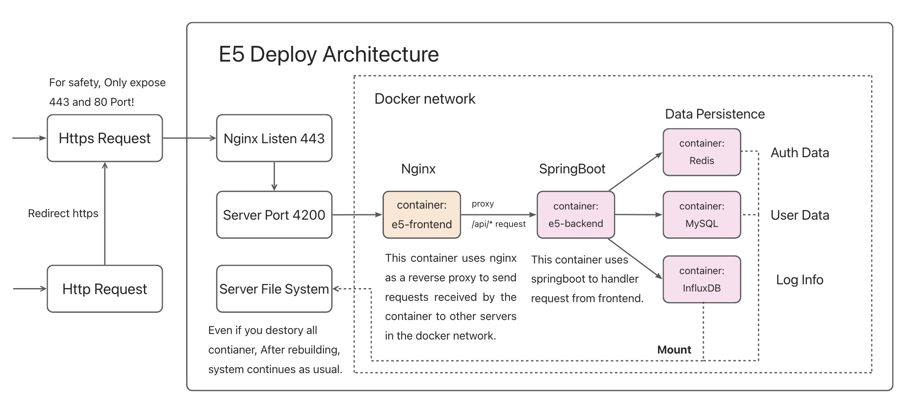

## E5-Toolkit
### 1. Introduction

- This is a tool for quick build qyi-e5 web. The original Author is [qyi](https://github.com/luoye663/e5). if you want to support or check his origianal repository, refer to: [luoye663/e5: e5-backend](https://github.com/luoye663/e5) and [luoye663/e5-html](https://github.com/luoye663/e5-html)
- E5 is a developer project for microsoft office 365, only if you keep active in developing

- Before you start, you'd better have a glimpse of the architecture of this project. Take a look of this!



- However, In docker-compose file, I also open database related port for debug(Like MySQL 3389....), So If you want to make your SQL or Influx data more safe, **you need to restrict Safety Groups Or Open Only 443 Port For your data safe.** Or you can modify **related Password and token,** and env file. 
- The effect of this project is like this. It will auto invoke APIs of Microsoft after your successful deploy.


### 2. Preparation

- To get started, you need a domain first, and then, a 2-core 2-g server is for deployment.You can also doploy it to your localhost server, but I willn't provide any instuctions.
- You also need your domain SSL cert. There are many free ssl-cert you can apply. Like [Aliyun](https://www.aliyun.com/) and so on. When you download your SSL cert, if you are supposed to make a choice, choose **Nginx** first.
- Then you need to create an breand new server.(Or reinstall operating system). Ubuntu-20.04LST is strongly recommended! Don't worry if your server are arm64 CPU, since my docker Image support both arm64 and amd64.

### 3. Setup Docker Engine

- First of all, let's setup docker, following the instruction from docker official [Install Docker Engine on Ubuntu | Docker Documentation](https://docs.docker.com/engine/install/ubuntu/)
- You may need to run these command one by one.

```shell
sudo apt-get remove docker docker-engine docker.io containerd runc
```

- Install Docker use these.

```shell
sudo apt-get update
sudo apt-get install \
    ca-certificates \
    curl \
    gnupg
    
sudo install -m 0755 -d /etc/apt/keyrings
curl -fsSL https://download.docker.com/linux/ubuntu/gpg | sudo gpg --dearmor -o /etc/apt/keyrings/docker.gpg
sudo chmod a+r /etc/apt/keyrings/docker.gpg

echo \
  "deb [arch="$(dpkg --print-architecture)" signed-by=/etc/apt/keyrings/docker.gpg] https://download.docker.com/linux/ubuntu \
  "$(. /etc/os-release && echo "$VERSION_CODENAME")" stable" | \

sudo tee /etc/apt/sources.list.d/docker.list > /dev/null
  
sudo apt-get update

sudo docker run hello-world
```

### 4. Add user to DockerGroup

- To make it more convenient to run docker cmd, add your user to docker groups

```shell
sudo groupadd docker
sudo usermod -aG docker $USER
newgrp docker
docker run hello-world
```

- If you can run hello-world successfully, you have done all.
- Otherwise,  **reboot your server to make changes effect**

### 5. Clone repo

- Install git on your server

```shell
sudo apt-get update
sudo apt-get install git
```

- Then, clone my repo.

```
git clone 
```


